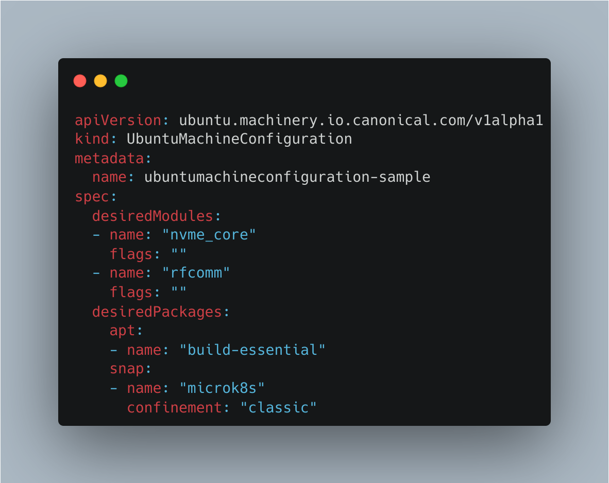

# Ubuntu Operator


_Control Ubuntu from Kubernetes_

Imagine a world where your Kubernetes nodes can be managed and controlled from primitives that represent desired intent and are constantly reconciled.
This project initially looks at the package management system and kernel modules for Ubuntu as an example of how this can be built upon.

## Project status: Alpha/Conceptual/POC/Functional-but-not-for-production





Control your underlying Ubuntu distribution through Kubernetes....


[](https://asciinema.org/a/wKRetUd3rnpKFGWTJ7CEVfWcX)


## Roadmap

- [x] Kernel module support
- [x] APT Package system support
- [x] Snap Package system support
- [ ] Improvements to package system support 

## Installation

Two step installation process.
1. Installing the host-relay on all hosts
2. Installing the Operator in cluster once.

### Host-relay

`make install-relay`

### Operator 
```
make install # Uploads the CustomResourceDefinitions into your cluster
make deploy
```


